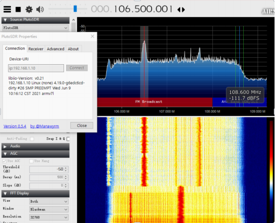
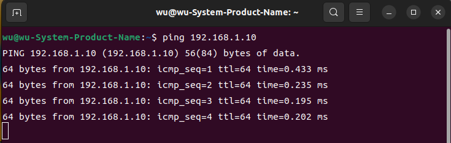

## E200 Unpacking examination

[[中文]](../../../cn/device_and_usage_manual/ANTSDR_E_Series_Module/ANTSDR_E200_Reference_Manual/AntsdrE200_Unpacking_examination_cn.html)

### ●1. 概述

The E200 is a software-defined radio (SDR) platform designed for makers and SDR enthusiasts, while also suitable for professional application scenarios. It supports wideband RF signal transmission and reception from 70 MHz to 6 GHz. The device can be controlled via Gigabit Ethernet or operate independently through programming. With abundant open-source project support and learning resources, users can explore a wide range of applications.

### ●2. Package Contents

Thank you for purchasing the ANTSDR series SDR platform from MicroPhase Technology .Upon receiving your ANTSDR E200 (Standard Edition), open the accessory kit, which should include the following items:

- ANTSDR SDR Device: X1

- USB Data Cables: X2 

- Short Rubber Antennas: X2

- Tray Antenna: X1

- Card Reader: X1

- Ethernet Cable: X1

- 32GB SD Card X1

After unpacking, please check all items.

### ●3. ANTSDR Driver Software Installation

Next, use the **Pluto firmware** to receive radio broadcasts.

The ANTSDR E200 comes preloaded with both Pluto and UHD firmware options. By default, the Pluto firmware is written to the QSPI flash. To receive broadcasts using the Pluto firmware, simply set the DIP switch to boot from QSPI. Alternatively, you can download the Pluto firmware to an SD card and boot from the SD card as well.

If you do not have the Pluto firmware, you can download it from GitHub:[Download Pluto Firmware](https://github.com/MicroPhase/antsdr-fw-patch/releases)。

Since the Pluto firmware is pre-installed on the E200, using it is straightforward. The default IP address of the Pluto firmware is **192.168.1.10**, with the username and password being **root** and **analog** respectively, and the baud rate set to **115200**.

The DIP switch for setting the boot mode is located below the Ethernet port on the case, labeled as BOOT, QSPI, and SD. Set the switch to QSPI mode. Upon powering on, a green LED will start blinking.

### ● Windows

○1. Install Windows Drivers:： 

To access the serial console and view system boot logs, you need to install the CH340 driver. The E200 uses the CH340 chip for serial communication. You can find the CH340 driver in the documentation folder.

Connect one end of the Ethernet cable to the ANTSDR and the other to your PC. Attach the antenna to the RX1 port.

○2.Configure your network adapter，Set your PC's IP address to be in the same subnet as the ANTSDR. For example:IP Address: 192.168.1.100 ,Subnet Mask: 255.255.255.0 , Default Gateway: 192.168.1.1

○4. The IP address of the ANTSDR is 192.168.1.10. Open a CMD window and run ping 192.168.1.10.

○5. Receive Broadcasts

Launch SDRSharp.exe to start listening to FM radio.

The IP address for the ANTSDR device is 192.168.1.10.

Once connected, select a broadcast channel to start receiving.

### ● Linux 

○1. The Pluto firmware’s default IP is **192.168.1.10**. Set your local IP to **192.168.1.100**, then run **ping 192.168.1.10**.

○2. You can follow the instructions on this page to install[libiio](https://wiki.analog.com/resources/eval/user-guides/ad-fmcdaq2-ebz/software/linux/applications/libiio#:~:text=Libiio%20is%20a%20library%20that%20has%20been%20developed,of%20software%20interfacing%20Linux%20Industrial%20I%2FO%20%28IIO%29%20devices.)

Alternatively, refer to this page for a detailed setup guide: [AntsdrE200 Gnurdio](./AntsdrE200_gnurdio.md)

○3. Once libiio is installed, run iio_info -s to verify the connection.

You can connect via Gigabit Ethernet or USB OTG.
Launch SDR++ software.
Once connected, you can start receiving broadcasts.

